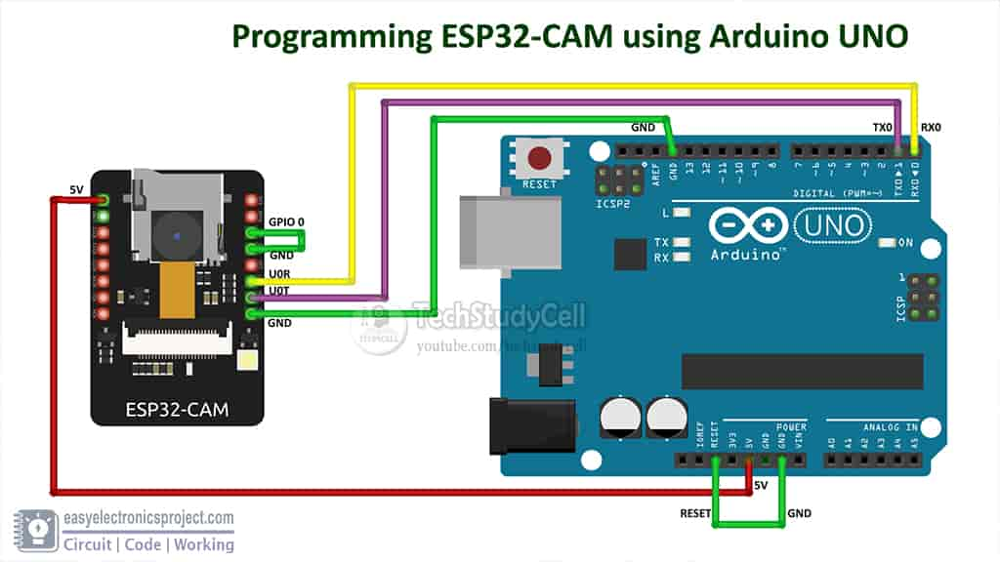
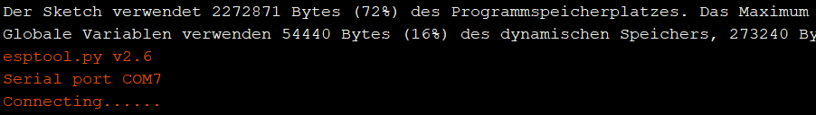

## Entwicklung eines kostengünstigen und universellen Prototypen für Proof-of-Concept im Bereich Smart City

### Bachelorarbeit von Schmuckermeier Daniel im WS 20/21 bei Professor Khelil

### Wie kann ich das Projekt richtig verwenden?

Getestet wurde dies unter Windos 10 Home.
Bei anderen Betriebssystemen können andere Schritte notwendig sein.

Alle Bibliotheken oder Programme wurden in der aktuellesten Version genutzt.

#### Einrichtung der IDE - Arduino

Arduino (1.8.13) (Windows Store 1.8.42.0)
[Download hier](https://www.arduino.cc/en/software) oder über den Windows Store

Um das ESP32 als Board nutzen zu können, muss man es erst in Arduino einbinden.
*Datei -> Voreinstellungen -> Zusätzliche Boardverwalter-URLs* und dann diesen Link einfügen: *https://dl.espressif.com/dl/package_esp32_index.json*

Im Folgenden werden die ganzen Bibliotheken für den ESP32 heruntergeladen.
*Werkzeuge -> Board -> Boardverwalter* und nach esp32 suchen und dies installieren. (Version 1.0.4)

[Notwendige Treiber installieren](https://www.silabs.com/developers/usb-to-uart-bridge-vcp-drivers)

#### IDE Konfiguration für die einzelnen ESP32

Im seriellen Monitor die baud rate auf 115200 setzen.

##### ESP32 Heltec (OLED) - Server

Um das Heltec Wifi 32 Kit als Board nutzen zu können, muss man es erst in Arduino einbinden.
*Datei -> Voreinstellungen -> Zusätzliche Boardverwalter-URLs* und dann diesen Link einfügen: *https://resource.heltec.cn/download/package_heltec_esp32_index.json*

Im Folgenden werden die ganzen Bibliotheken für das Heltec Board heruntergeladen.
*Werkzeuge -> Board -> Boardverwalter* und nach Heltec ESP32 Series Dev-boards suchen und dies installieren. (Version 0.0.5)

Um Beispiele und nützliche Heltec Bibliotheken parat haben einfach den folgenden Anweisungen folgen.
[Heltec_ESP32 Library (Version 1.1.0)](https://github.com/HelTecAutomation/Heltec_ESP32)
-> unter *How to install this library* den für sich besten Weg auswählen.

###### Sketch hochladen

Um das Board auszuwählen, wählt man *Werkzeuge -> Board -> ESP32 Arduino -> Heltec WiFi Kit 32* aus.

*Werkzeuge -> Partition Scheme -> Huge APP (3MB No OTA)*  auswählen, um den Speicher vollkommen auszunutzen.

Man benötigt nur ein Micro-USB-Kabel (Wichtig: Datenkabel und kein reines Stromladekabel)

Unter *Werkzeuge -> Port -> (Com * )*, den Port auswählen, an dem das ESP32 dranhängt.

Nachdem das Sketch hochgeladen wurde, musst man kurz auf die RST-Taste drücken, um das Sketch zu wechseln.

##### ESP32 Cam - Client

Die schwarze Plastikkappe kann man aufklappen, um die Cam zu entfernen.

Um das Board auszuwählen, wählt man *Werkzeuge -> Board -> ESP32 Arduino -> ESP32 Wrover Module* aus.

*Werkzeuge -> Upload Speed -> 115200*  auswählen, um den Upload Speed anzupassen.

*Werkzeuge -> Partition Scheme -> Huge APP (3MB No OTA/1MB SPIFFS)*  auswählen, um den Speicher vollkommen auszunutzen.

Die Cam hat keine Micro-USB Schnittstelle, deswegen wird ein Arduino Uno zwischengeschaltet. Dieser überträgt das Sketch zur Cam.

 

ESP32 Cam       | Arduino Uno
----------------|------------
U0T             | TX
U0R             | RX
5V              | 5V
GND             | GND
GPIO-0 –> GND	| Reset –> GND
 

Unter *Werkzeuge -> Port -> (Com * )*, den Port auswählen, an dem das ESP32 dranhängt.

Nachdem *Connecting....__* (siehe Bild) in der Konsole erscheint, kurz die RST-Taste drücken.

  

Ist das Sketch vollständig hochgeladen, die GPIO-Brücke (GPIO-0 –> GND) am ESP32 entfernen.

#### Sonstiges

Möchte man beide ESP32 im Dauerbetrieb laufen lassen, muss nur für eine Stromversorgung gesorgt werden.
ESP32 OLED -> Micro-USB-Kabel anschließen
ESP32 Cam -> 5V und GND anschließen

ESP32 Cam       | Arduino Uno
----------------|------------
5V              | 5V
GND             | GND

[Vollständige-IDE-Einrichtung-und-erste-Sketch-Beispiel-Nutzung-Anleitung mit Bildern](https://randomnerdtutorials.com/installing-the-esp32-board-in-arduino-ide-windows-instructions/)

